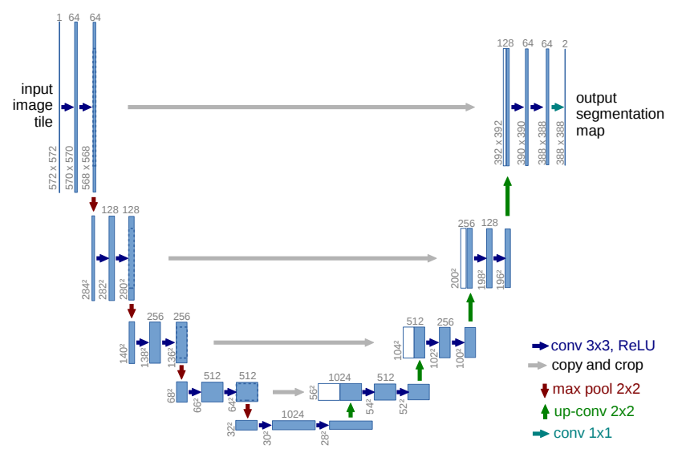

# UNet-pytorch
<b>[U-Net](https://arxiv.org/abs/1505.04597): U-Net: Convolutional Networks for Biomedical Image Segmentation</b>



***
## Introduction
This is a pytorch implementation of UNet for semantic segmentation especially for remote sensing images by [JeasunLok](https://github.com/JeasunLok). If it is useful for you, please give me a star!

***

## Installation
Create the environment and install the requirements.
```
git clone https://github.com/JeasunLok/UNet-pytorch.git
conda create -n unet python=3.9
conda activate unet
pip install -r requirements.txt
```
If you want to use GPU, please check your CUDA version and download the proper version of [pytorch](https://pytorch.org/get-started/locally/). Use CUDA 12.1 as example:
```
nvcc --version
pip3 install torch torchvision torchaudio --index-url https://download.pytorch.org/whl/cu121
```
***

## Download and set the Dataset
#### Dataset building
The dataset building has been placed in folder ```data```. Then run the ```generate_list.py``` file to split the dataset into train, validate and test set with a proper ratio (3 ratio can be set in the file). 

If you want to use your own dataset, <b>You should change the parameter or the format of your dataset in the file ```generate_list.py``` and ```utils/dataloader.py``` </b> 

***

## How to use it
1. When the dataset is perpared and split correctly, you should revise the files in the folder ```dataset/list```.
2. Revise and define your settings in ```main.py```, all the settings can be revised in this file, including epoch, lr, batch size and so on.
3. Run the file of ```main.py``` to train, validate and test your model.
4. ```predict.py``` provides a method for predicting by a trained model with gdal for remote sensing image with tif format. If you want to use it to predict images with other format, please change the setting inside it.
***

## License
The repository is licensed under the Apache 2.0 license.
***
